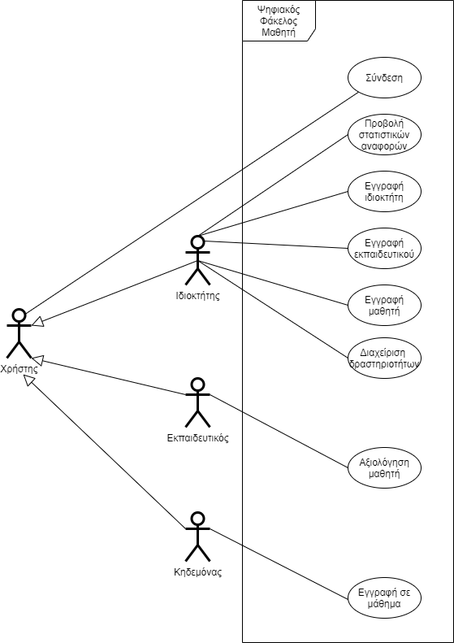
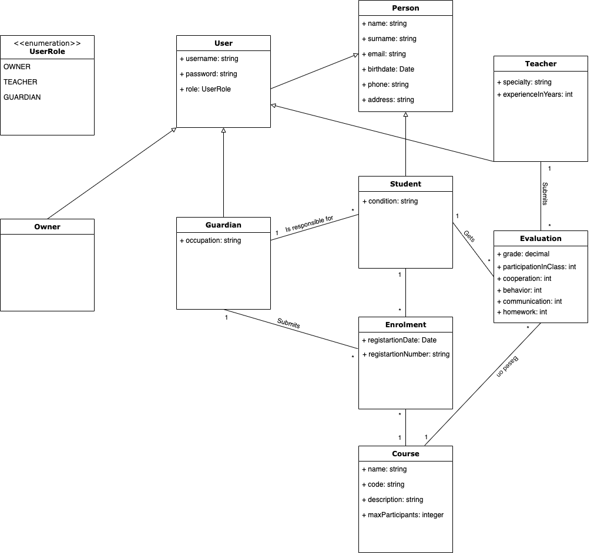

## English Section

# Introduction

Within the scope of this project, we aim to design and develop a platform that assists in digitizing the daily operations of an association working with individuals with special needs, with the ultimate goal of creating and managing a student's folder. This folder will contain a comprehensive overview of the student. In this field, it is crucial to have knowledge of children's history, overall behavior, and their reactions. This allows educators to approach each case more effectively, aiming to achieve their work to the fullest extent.

## Scope

Indicatively, the proposed platform will have the following sections:
1) Student/Teacher/Guardian Information
- The owner will register on the platform.
- The school owner will create accounts for collaborating educators in the system.
- The owner will create accounts for students and notify guardians.

2) Student Activities
- Activities of various categories will be offered to students (music, physical activities, etc.), in which guardians will enroll students through the system.
- Activities will have a limited number of participants.

3) Daily Session/Class Evaluations
- Each educator will dynamically evaluate students on their participation in activities, on a scale of 0-5 (e.g., collaboration score ranging from 0-5, satisfaction score 0-5, manifestation of crises 0-5, etc.), allowing data extraction regarding students' abilities/habits.

4) Statistical Data
- The system will produce anonymous statistics regarding the acceptance of various types of activities by students, as well as measurements regarding students' progress over time.

# Overall Description

## Use Case Model Overview

1. [Owner Registration](owner_registration.md)

2. [Teacher Registration](teacher_registration.md)

3. [Student Registration](student_registration.md)

4. [Reporting](reporting.md)

5. [Activities Management](activities_management.md)

6. [Login](login.md)

7. [Student Enrollment in Activity](enrolment.md)

8. [Student Activity Evaluation](evaluation.md)

# Special Requirements

## Use Cases

### Stakeholders and their Needs

Stakeholders interested in this information system are:
- the school owner, who needs to digitize school procedures to have a better overview and management of the situation.
- the educator, who will provide a description of the daily procedures followed and the difficulties faced.
- the guardian, who will describe the information they would like to have access to at any time.

### System Actors

1) Owner
2) Educator
3) Guardian

## Supplementary Specifications

### Quality Characteristics

#### Performance

- The system should efficiently run on a simple VPS with minimum resources.
- The system should be usable on a simple personal computer.

#### Availability

The system should be available at all times and have health checking and high availability mechanisms.

#### Security

The system should support role-based authorization and authentication.

# Supporting Material

## Domain Model

---

## Greek Section

# Εισαγωγή

Στα πλαίσια της εργασίας του μαθήματος θα θέλαμε να σχεδιάσουμε και να αναπτύξουμε μια πλατφόρμα η οποία θα
βοηθάει να ψηφιοποιηθούν οι καθημερινές εργασίες ενός συλλόγου με άτομα με ειδικές ικανότητες έχοντας ως τελικό
σκοπό την δημιουργία και τη διαχείριση του φακέλου ενός μαθητή. Αυτός ο φάκελος θα περιέχει τη συνολική και ολοκληρωμένη εικόνα του
μαθητή. Στον συγκεκριμένο κλάδο είναι πολύ σημαντικό να γνωρίζει κανείς το ιστορικό των παιδιών και την συνολική
συμπεριφορά τους καθώς, και τις αντιδράσεις αυτών. Με αυτόν τον τρόπο ο παιδαγωγός έχει τη δυνατότητα μιας πιο εξιδεικευμένης προσέγγισης
για κάθε περίπτωση, με σκοπό να επίτυχει το έργο του στο βέλτιστο βαθμό.

## Εμβέλεια

Ενδεικτικά η προτεινόμενη πλατφόρμα θα έχει τις παρακάτω ενότητες :
1) Στοιχεία Μαθητή/Εκπαιδευτή/Κηδεμόνα
- Ο ιδιοκτήτης θα εγγράφεται στην πλατφόρμα
- Ο ιδιοκτήτης του συλλόγου θα δημιουργεί τους λογαριασμούς των συνεργαζόμενων εκπαιδευτικών στο σύστημα
- Ο Ιδιοκτήτης θα δημιουργεί τους λογαριασμούς των μαθητών και θα τους κοινοποιεί στους κηδεμόνες

2) Μαθήματα/Δραστηριότητες μαθητή
- Θα προσφέρονται δραστηριότητες διαφόρων κατηγοριών προς τους μαθητές (μουσικές, κινητικές κτλ.) στις οποίες θα δηλώνουν συμμετοχή μέσω του συστήματος οι κηδεμόνες των μαθητών
- Οι δραστηριότητες θα έχουν περιορισμένο αριθμό συμμετεχόντων

3) Ημερήσιες Αξιολογήσεις Συνεδριών/Μαθημάτων
- Κάθε εκπαιδευτικός θα αξιολογεί με δυναμικές μετρικές τους μαθητές στις δραστηριότητες που συμμετέχουν, στην κλίμακα 0-5 (πχ. βαθμός συνεργασία με τιμές 0-5, βαθμός ευχαρίστησης 0-5, εμφάνιση κρίσεων 0-5 κτλ.)
  έτσι ώστε να εξάγονται δεδομένα σχετικά με τις δυνατότητες/συνήθειες των μαθητών

4) Στατιστικά Στοιχεία
- Το σύστημα θα παράγει ανώνυμα στατιστικά σχετικά με την αποδοχή διαφόρων τύπων δραστηριοτήτων από τους μαθητές καθώς και μετρήσεις σχετικά με τη βελτίωση ή όχι της προόδου των μαθητών με την πάροδο του χρόνου

# Συνολική περιγραφή

## Επισκόπηση μοντέλου περιπτώσεων χρήσης

1. [Εγγραφή ιδιοκτήτη](owner_registration.md)

2. [Εγγραφή εκπαιδευτικού](teacher_registration.md)

3. [Εγγραφή μαθητή](student_registration.md)

4. [Παραγωγή στατιστικών](reporting.md)

5. [Διαχείριση δραστηριοτήτων](activities_management.md)

6. [Σύνδεση](login.md)

7. [Δήλωση συμμετοχής μαθητή σε δραστηριότητα](enrolment.md)

8. [Αξιολόγηση συμμετοχής μαθητή σε δραστηριότητα](evaluation.md)

# Ειδικές Απαιτήσεις

## Περιπτώσεις χρήσης

### Οι ενδιαφερόμενοι και οι ανάγκες τους

Ενδιαφερόμενοι για το παρών πληροφοριακό σύστημα είναι:
- ο ιδιοκτήτης του σχολείου ο οποίος χρειάζεται να ψηφιοποιήσει τις διαδικασίες του σχολείου για να μπορεί να έχει καλύτερη εικόνα και διαχείριση της καταστασης.
- ο εκπαιδευτικός, ο οποίος θα μας δώσει μια περιγραφή των καθημερινών διαδικασιών που ακολουθεί και των δυσκολιών που αντιμετωπίζει
- ο κηδεμόνας ο οποίος θα μας περιγράψει την πληροφορία στην οποία θα ήθελε να μπορεί να έχει πρόσβαση ανα πάσα στιγμή
### Actors του συστήματος

1) Ιδιοκτήτης
2) Εκπαιδευτικός
3) Κηδεμόνας

## Συμπληρωματικές προδιαγραφές

### Ποιοτικά χαρακτηριστικά

#### Απόδοση

- Το σύστημα θα πρέπει να μπορεί να εκτελείται αποδοτικά σε ένα απλό VPS με minimum resources
- Το σύστημα θα πρέπει να μπορεί να χρησιμοποιείται από έναν απλό ηλεκτρονικό υπολογιστή

#### Διαθεσιμότητα

Το σύστημα θα πρέπει να είναι διαθέσιμο όλες τις ώρες και να έχει μηχανισμούς health checking και high availability.

#### Ασφάλεια

Tο σύστημα θα πρέπει να υποστηρίζει role based authorization και authentication

# Υποστηρικτικό υλικό

## Μοντέλο πεδίου

